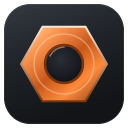
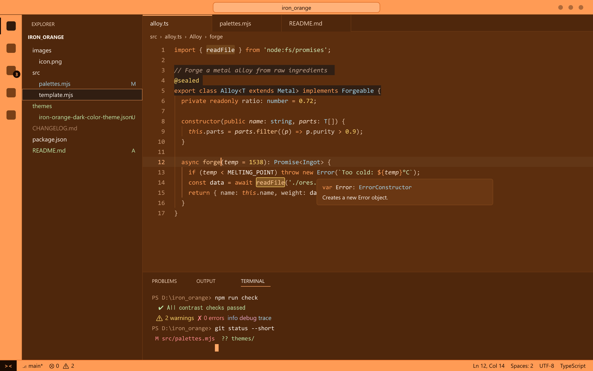
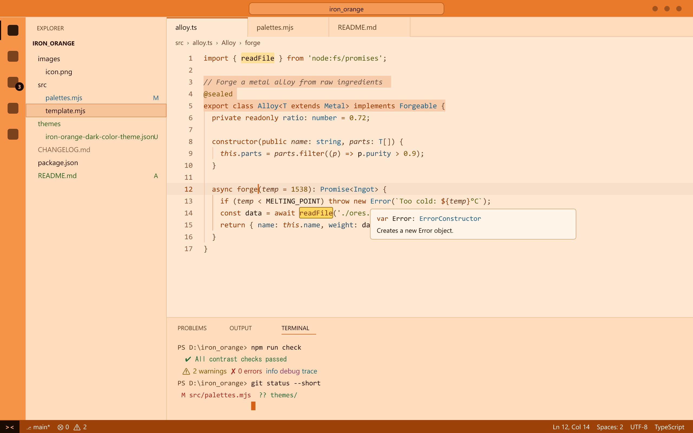

<p align="center">
  
</p>

<h1 align="center">Iron Orange</h1>

<p align="center">
  A metallic orange theme for Visual Studio Code: copper and mandarin surfaces, orange bars,<br>
  and text that stays readable everywhere, including inside selections.
</p>

<p align="center">
  <a href="https://marketplace.visualstudio.com/items?itemName=db0w.iron-orange"></a>
  <a href="https://marketplace.visualstudio.com/items?itemName=db0w.iron-orange"></a>
  <a href="https://marketplace.visualstudio.com/items?itemName=db0w.iron-orange&ssr=false#review-details"></a>
  <a href="https://github.com/db0w/iron-orange-vstheme/stargazers"></a>
  <a href="https://github.com/db0w/iron-orange-vstheme/forks"></a>
  <a href="https://github.com/db0w/iron-orange-vstheme/blob/main/LICENSE"></a>
</p>

## Iron Orange Dark



## Iron Orange Light



## Highlights

- **Two variants, one family.** *Dark* puts a bright copper editor inside light orange title, activity and status bars. *Light* pairs a soft mandarin editor with orange bars and a deep copper status bar.
- **Contrast you can rely on.** Every syntax color reaches at least 4.5:1 (WCAG AA) against the editor background, and the main text reaches at least 7:1 (WCAG AAA). 360 automated checks run on every build, so a palette change can't ship if it breaks readability.
- **Selections that stay readable.** Most themes lose contrast when you select code. Iron Orange checks every syntax color on top of the selection too. The dark variant uses a translucent gunmetal selection that makes selected text *more* legible, not less.
- **A metallic palette.** Keywords in orange, functions in light copper, strings in patina green, types in steel blue, numbers in amber, constants in rose copper.
- **Complete coverage.** 453 workbench colors per variant, the full 16-color terminal palette, bracket pair colorization and semantic highlighting.

## Installation

1. Open the **Extensions** view (`Ctrl+Shift+X` on Windows and Linux, `Cmd+Shift+X` on macOS).
2. Search for **Iron Orange** and select **Install**.

You can also use Quick Open (`Ctrl+P` / `Cmd+P`):

```
ext install db0w.iron-orange
```

Or the command line:

```bash
code --install-extension db0w.iron-orange
```

## Usage

Open the theme picker with `Ctrl+K Ctrl+T` (`Cmd+K Cmd+T` on macOS) and choose **Iron Orange Dark** or **Iron Orange Light**.

To follow your operating system's light or dark mode automatically, add this to your `settings.json`:

```jsonc
{
  "window.autoDetectColorScheme": true,
  "workbench.preferredDarkColorTheme": "Iron Orange Dark",
  "workbench.preferredLightColorTheme": "Iron Orange Light"
}
```

With [Settings Sync](https://code.visualstudio.com/docs/configure/settings-sync) turned on (with *Extensions* and *Settings* selected), your other machines install Iron Orange and switch to it automatically.

## Palette

| Role | Dark | Light |
|---|---|---|
| Editor background |  `#5C2E0E` |  `#FFE8D1` |
| Side bar and panel |  `#4F270C` |  `#FFDDBC` |
| Title and activity bars |  `#FF9B55` |  `#E97A2A` / `#F59346` |
| Status bar |  `#FF9B55` |  `#9C4209` |
| Selection |  `#121417` at 60% |  `#D66014` at 20% |
| Text |  `#FFF6EE` |  `#241005` |
| Keywords |  `#FF9B55` |  `#9E3800` |
| Functions |  `#FFC894` |  `#8A3A0A` |
| Strings |  `#CFE8B4` |  `#566010` |
| Types and classes |  `#A6D3E8` |  `#1F5F82` |
| Numbers |  `#FFD66B` |  `#7F5100` |
| Constants |  `#F7AE9A` |  `#A33129` |
| Comments |  `#C19F87` |  `#6C5546` |

### Measured contrast

| Measurement | Dark | Light |
|---|---|---|
| Main text on the editor | 10.6:1 | 15.4:1 |
| Main text on a selection | 14.9:1 | 12.4:1 |
| Lowest syntax color on the editor | 4.6:1 | 5.7:1 |
| Lowest syntax color on a selection | 6.5:1 | 4.6:1 |
| Title bar text | 9.2:1 | 6.7:1 |
| Status bar text | 9.2:1 | 6.6:1 |

## Customization

You can override any color for one variant in your `settings.json`:

```jsonc
{
  "workbench.colorCustomizations": {
    "[Iron Orange Dark]": {
      "statusBar.border": "#00000000"
    }
  },
  "editor.tokenColorCustomizations": {
    "[Iron Orange Dark]": {
      "comments": "#D2B49C"
    }
  }
}
```

## Contributing

Issues and pull requests are welcome on [GitHub](https://github.com/db0w/iron-orange-vstheme/issues).

The theme files in `themes/` are generated, so don't edit them by hand. Colors live in `src/palettes.mjs`, and `src/template.mjs` maps them onto VS Code's theme keys.

```bash
git clone https://github.com/db0w/iron-orange-vstheme.git
cd iron-orange-vstheme
npm install
npm run build && npm run check
```

| Command | What it does |
|---|---|
| `npm run build` | Generates `themes/*.json` from the palettes |
| `npm run check` | Runs the contrast checks and fails if any color falls below its threshold |
| `npm run preview` | Renders a mock editor for each variant to `preview/` |
| `npm run screenshots` | Renders the README screenshots to `images/screenshots/` |
| `npm run package` | Builds, checks and packages the `.vsix` |

Press `F5` in VS Code to open an Extension Development Host with the `samples/` folder and see your changes on real code.

## Support

If Iron Orange makes your editor a nicer place, [star the repository](https://github.com/db0w/iron-orange-vstheme) or [leave a review on the Marketplace](https://marketplace.visualstudio.com/items?itemName=db0w.iron-orange&ssr=false#review-details). Both help other people find it.

## License

[MIT](LICENSE) © 2026 db0w
